<div align="center">

# Aficion

A constellation atlas of hobbies: highlight yours, trace the paths between them, and compare maps with friends

[![Live][badge-site]][url-site]
[![HTML5][badge-html]][url-html]
[![CSS3][badge-css]][url-css]
[![JavaScript][badge-js]][url-js]
[![Claude Code][badge-claude]][url-claude]
[![License][badge-license]](LICENSE)

[badge-site]:    https://img.shields.io/badge/live_site-0063e5?style=for-the-badge&logo=googlechrome&logoColor=white
[badge-html]:    https://img.shields.io/badge/HTML5-E34F26?style=for-the-badge&logo=html5&logoColor=white
[badge-css]:     https://img.shields.io/badge/CSS3-1572B6?style=for-the-badge&logo=css3&logoColor=white
[badge-js]:      https://img.shields.io/badge/JavaScript-F7DF1E?style=for-the-badge&logo=javascript&logoColor=black
[badge-claude]:  https://img.shields.io/badge/Claude_Code-CC785C?style=for-the-badge&logo=anthropic&logoColor=white
[badge-license]: https://img.shields.io/badge/license-MIT-404040?style=for-the-badge

[url-site]:   https://aficion.neorgon.com/
[url-html]:   #
[url-css]:    #
[url-js]:     #
[url-claude]: https://claude.ai/code

</div>

---

## Overview

Aficion lays every hobby on one connected map, with the crafts that sit
underneath them drawn on the same canvas rather than hidden in a legend. Mark
what you practise and your nodes turn gold, the links between the adjacent ones
light up, and two things you thought were unrelated turn out to be two steps
apart through a craft you already have. It is for the person with four shelves
in one room who has never seen the four as one object, and for the friend they
send the link to.

Nothing is scored and nothing is ranked. A suggestion arrives with the sentence
that justifies it, built from a shared craft, a shared tag or shared gear, and
the map rings the node that sentence names.

**Live:** aficion.neorgon.com

---

## Features

- **One connected fabric** -- 268 hobbies across 18 clusters plus the transversal crafts, all reaching a single hub, on a pannable and zoomable canvas
- **Your own path, lit** -- marking adjacent nodes draws the gold line between them; marking distant ones reports how many steps apart they are and through what, with a Trace button that flies to the bridge
- **A reason, not a ranking** -- every suggestion carries the sentence that justifies it and is ringed in ember on the map, so the panel and the canvas say the same thing. No score, no percentage, no compatibility number
- **Inner trees** -- ten hobbies open into their own subgraph of subgenres and techniques, 77 nodes deep, markable like any other
- **Curated builds** -- six ordered stacks showing what a flagship pursuit actually needs, each step with a level and a reason, applied to your map in one click
- **Share and compare** -- your whole profile is a gzipped URL fragment, which browsers never send to a server. Paste a friend's link to see what sits on both maps, what is one step away, and a per-cluster tally
- **Keyboard and screen reader routes** -- arrow keys walk the graph, every reachable node is also a real button, and each move announces the node and its blurb

---

## Keyboard

| Key | Does |
|---|---|
| Drag, wheel or pinch | Pan and zoom the canvas |
| Arrows | Walk to a neighbouring node |
| Shift + arrows | Pan the camera |
| Enter | Mark or unmark the focused node |
| `I` | Drill into an inner tree |
| `F` | Fit the whole atlas |
| `M` | Fit your own marks |
| `/` | Focus the search box |
| Escape | Clear a trace, or close the drill-in |

---

## Running locally

ES modules require an HTTP server (not `file://`):

```bash
make serve
```

Then open http://localhost:8877.

The taxonomy under `data/` is validated by a dependency-free Node script. It
exits 0, or it names the file, the record and the field that is wrong:

```bash
make validate    # or: make corpus, the same target under both names
```

---

## Architecture



Zero build: no bundler, no npm dependency for the app, no backend. The corpus is
static JSON fetched at boot; the profile lives in `localStorage` and in the URL
fragment.

```
aficion-site/
├── index.html              # HTML shell: header, canvas stage, side panel, dialogs
├── css/
│   └── style.css           # All site styles. Identity is --accent only; the rest is CDN base.css
├── js/
│   ├── app.js              # Entry point, under 50 lines
│   ├── state.js            # Shared mutable state, localStorage
│   ├── render.js           # Builds the ViewModel for the canvas, renders the panel
│   ├── events.js           # All wiring. No inline onclick anywhere
│   ├── actions.js          # Marking, tracing, flying, drill-in
│   ├── panels.js           # Detail, mine, suggestion, compare and build panels
│   ├── modal.js            # Native <dialog> helper with focus restore
│   ├── utils.js            # escHtml, live region, small helpers
│   ├── alloc.js            # Allocated set, gold route, components, bridges, buckets
│   ├── discover.js         # Suggestions and the sentence that justifies each one
│   ├── profile.js          # URL codec: gzip + urlsafe base64, versioned, migration chain
│   ├── compare.js          # Two profiles in, four sets and a per-bucket tally out
│   ├── inner.js            # Inner-tree overlay
│   ├── builds.js           # Curated builds
│   └── atlas/
│       ├── load.js         # Fetches and indexes the corpus, memoised inner trees
│       ├── layout.js       # Five deterministic layout recipes from cluster anchors
│       ├── camera.js       # Pan, zoom-at-cursor, clamps, flyTo
│       ├── pick.js         # Hit-testing with a 12px screen-space floor
│       ├── theme.js        # Reads canvas colours from CSS custom properties
│       ├── draw.js         # Frame orchestration. ctx.filter is never set: not Baseline
│       ├── draw-edges.js   # Edge passes, widest and faintest first
│       ├── draw-nodes.js   # Node passes: face, halo, rings per channel
│       └── draw-labels.js  # Label placement with collision rejection
├── data/                   # The corpus. Content is data, never inside a .js file
│   ├── atlas.json          # Clusters, tags, retired ids
│   ├── edges.json          # 563 top-layer edges, typed
│   ├── builds.json         # 6 curated builds
│   ├── clusters/*.json     # 18 cluster files, 268 top nodes
│   └── inner/*.json        # 10 inner trees, 77 nodes
├── tools/
│   └── validate-corpus.mjs # 33 structural checks over data/. Plain node, no install
├── docs/
│   └── architecture.mmd    # Source for architecture.svg
├── 404.html
├── CNAME
├── Makefile
└── README.md
```

---

<div align="center">
<sub>Part of <a href="https://neorgon.com/">Neorgon</a></sub>
</div>
