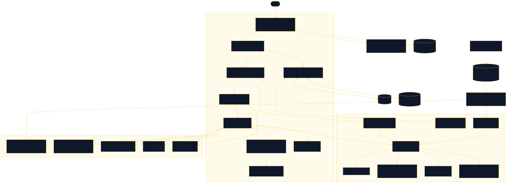

<div align="center">

# Aficion

A constellation atlas of hobbies: highlight yours, trace the paths between them, and compare maps with friends

[![Live][badge-site]][url-site]
[![HTML5][badge-html]][url-html]
[![CSS3][badge-css]][url-css]
[![JavaScript][badge-js]][url-js]
[![Claude Code][badge-claude]][url-claude]
[![License][badge-license]](LICENSE)

[badge-site]:    https://img.shields.io/badge/live_site-0063e5?style=for-the-badge&logo=googlechrome&logoColor=white
[badge-html]:    https://img.shields.io/badge/HTML5-E34F26?style=for-the-badge&logo=html5&logoColor=white
[badge-css]:     https://img.shields.io/badge/CSS3-1572B6?style=for-the-badge&logo=css3&logoColor=white
[badge-js]:      https://img.shields.io/badge/JavaScript-F7DF1E?style=for-the-badge&logo=javascript&logoColor=black
[badge-claude]:  https://img.shields.io/badge/Claude_Code-CC785C?style=for-the-badge&logo=anthropic&logoColor=white
[badge-license]: https://img.shields.io/badge/license-MIT-404040?style=for-the-badge

[url-site]:   https://aficion.neorgon.com/
[url-html]:   #
[url-css]:    #
[url-js]:     #
[url-claude]: https://claude.ai/code

</div>

---

## Overview

Aficion lays every hobby on one connected map, with the crafts that sit
underneath them drawn on the same canvas rather than hidden in a legend. Mark
what you practise and your nodes turn gold, the links between the adjacent ones
light up, and two things you thought were unrelated turn out to be two steps
apart through a craft you already have. It is for the person with four shelves
in one room who has never seen the four as one object, and for the friend they
send the link to.

Nothing is scored and nothing is ranked. A suggestion arrives with the sentence
that justifies it, built from a shared craft, a shared tag or shared gear, and
the map rings the node that sentence names.

**Live:** aficion.neorgon.com

---

## Features

- **Explore first**: six broad directions lead to 22 hobby families. Search also finds techniques and subtopics, with filters for easy starts and deeper branches.
- **Try a connected example**: the homepage previews coffee → lightsabers, miniatures → living worlds, and birdwatching → galaxies. Every example includes clickable stops, a side branch, a deeper subtopic and a guided Atlas entrance. Mobile search comes first.
- **Four connection views**: related hobbies, shared skills, shared equipment, and shared interests. Every result explains the link; inferred tag affinities are distinguished from authored edges.
- **Depth when you want it**: 24 inner trees contain 178 subtopics. Thirty small starting experiments help turn browsing into a first attempt. New content and navigation are available in English and Spanish.
- **Your hobbies**: save individual hobbies or techniques, revisit your collection, and follow its connections. A first visit starts empty; examples are opened explicitly.
- **A spatial atlas**: 331 top-level nodes and 662 links, with pan, zoom, category focus, and highlighted connection paths. Map controls and sidebar panels reveal detail progressively.
- **Follow your curiosity**: every connection appears through small arrows at their true bearings, with numbered groups for crowded paths. Explore local branches, shared crafts, and other regions; follow the gold trail or fit the whole route. A separate depth entrance opens an interactive subtopic tree. Saving is always an explicit bookmark action.
- **Trails to revisit**: name and save a connected route, or try one of six suggested trails through niche interests. Guided stops distinguish the dashed planned route from the solid gold path already explored. Saved routes stay in this browser, separate from your hobby collection; they support rename, remove and undo.
- **Projects, sharing, and comparison**: nine curated builds, a personal summary, and shareable profiles in URL fragments. Existing saved profiles and `#node=` links remain supported.
- **Keyboard and readable routes**: hobby pages have real links, buttons, breadcrumbs, visible focus, and browser Back support. The canvas retains its keyboard controls.

---

## Keyboard

| Key | Does |
|---|---|
| Drag, wheel or pinch | Pan and zoom the canvas |
| Arrows | Follow a connection in that direction |
| Backspace | Return along your exploration trail |
| Shift + arrows | Pan the camera |
| Enter | Mark or unmark the focused node |
| `I` | Drill into an inner tree |
| Double-click a dot | Open its subtopics |
| `F` | Fit the whole atlas |
| `M` | Fit your own marks |
| `/` | Focus the search box |
| Escape | Clear a trace, or close the drill-in |

---

## Running locally

ES modules require an HTTP server (not `file://`):

```bash
make serve
```

Then open http://localhost:8877.

The taxonomy under `data/` is validated by a dependency-free Node script. It
exits 0, or it names the file, the record and the field that is wrong:

```bash
make search-index # regenerate after corpus edits
make validate     # both languages, browse structure, connected trails, search-index freshness
make test         # search, graph navigation, route persistence and concurrent-loading regressions
make pages        # refresh crawler pages after corpus edits
```

---

Optional browser acceptance checks use Playwright from your development environment (the app has no runtime dependency):

```bash
node tools/check-explorer.cjs
node tools/check-explorer.cjs --webkit
node tools/check-atlas.cjs
node tools/check-atlas.cjs --webkit
node tools/check-atlas-branches.cjs
node tools/check-atlas-branches.cjs --webkit
node tools/check-trails.cjs
node tools/check-trails.cjs --webkit
```

With the preview server running, these check saved collections, subtopic search, browser history, sharing, map navigation, mobile layout, language switching and loading failures. Screenshots are written under `/private/tmp/aficion-*.png`. Set `AFICION_PREVIEW_URL` to test a different local port.

## Architecture



Zero build: no bundler, no npm dependency for the app, no backend. The corpus is
static JSON fetched at boot; the profile lives in `localStorage` and in the URL
fragment.

```
aficion-site/
├── index.html              # HTML shell: header, canvas stage, side panel, dialogs
├── css/
│   └── style.css           # All site styles. Identity is --accent only; the rest is CDN base.css
├── js/
│   ├── app.js              # Entry point, under 50 lines
│   ├── navigation.js       # Explore, category, hobby, collection and atlas routes
│   ├── explorer.js         # Browse lists, search, breadcrumbs and collection
│   ├── explore-detail.js   # Hobby pages, subtopics, starting exercises and lenses
│   ├── explore-model.js    # Search and explained connection queries
│   ├── explore-events.js   # Browser navigation and transitions into the atlas
│   ├── state.js            # Shared mutable state, localStorage
│   ├── render.js           # Builds the ViewModel for the canvas, renders the panel
│   ├── events.js           # All wiring. No inline onclick anywhere
│   ├── actions.js          # Marking, tracing, flying, drill-in
│   ├── panels.js           # Detail, mine, suggestion, compare and build panels
│   ├── modal.js            # Native <dialog> helper with focus restore
│   ├── utils.js            # escHtml, live region, small helpers
│   ├── alloc.js            # Allocated set, gold route, components, bridges, buckets
│   ├── discover.js         # Suggestions and the sentence that justifies each one
│   ├── profile.js          # URL codec: gzip + urlsafe base64, versioned, migration chain
│   ├── compare.js          # Two profiles in, four sets and a per-bucket tally out
│   ├── inner.js            # Inner-tree overlay
│   ├── builds.js           # Curated builds
│   └── atlas/
│       ├── load.js         # Fetches and indexes the corpus, memoised inner trees
│       ├── layout.js       # Five deterministic layout recipes from cluster anchors
│       ├── camera.js       # Pan, zoom-at-cursor, clamps, flyTo
│       ├── pick.js         # Hit-testing with a 12px screen-space floor
│       ├── theme.js        # Reads canvas colours from CSS custom properties
│       ├── draw.js         # Frame orchestration. ctx.filter is never set: not Baseline
│       ├── draw-edges.js   # Edge passes, widest and faintest first
│       ├── draw-nodes.js   # Node passes: face, halo, rings per channel
│       └── draw-labels.js  # Label placement with collision rejection
├── data/                   # The corpus. Content is data, never inside a .js file
│   ├── atlas.json          # Clusters, tags, retired ids
│   ├── edges.json          # 662 top-layer edges, typed
│   ├── explore.json        # Browse directions, example diagram and 30 first experiments
│   ├── search-index.json   # Generated index, including every inner subtopic
│   ├── builds.json         # 9 curated builds
│   ├── trails.json         # 6 guided discovery routes, all following authored edges
│   ├── clusters/*.json     # 22 cluster files, 321 hobby nodes
│   └── inner/*.json        # 24 inner trees, 178 nodes
├── tools/
│   └── validate-corpus.mjs # 33 structural checks over data/. Plain node, no install
├── docs/
│   └── architecture.mmd    # Source for architecture.svg
├── 404.html
├── CNAME
├── Makefile
└── README.md
```

---

<div align="center">
<sub>Part of <a href="https://neorgon.com/">Neorgon</a></sub>
</div>
